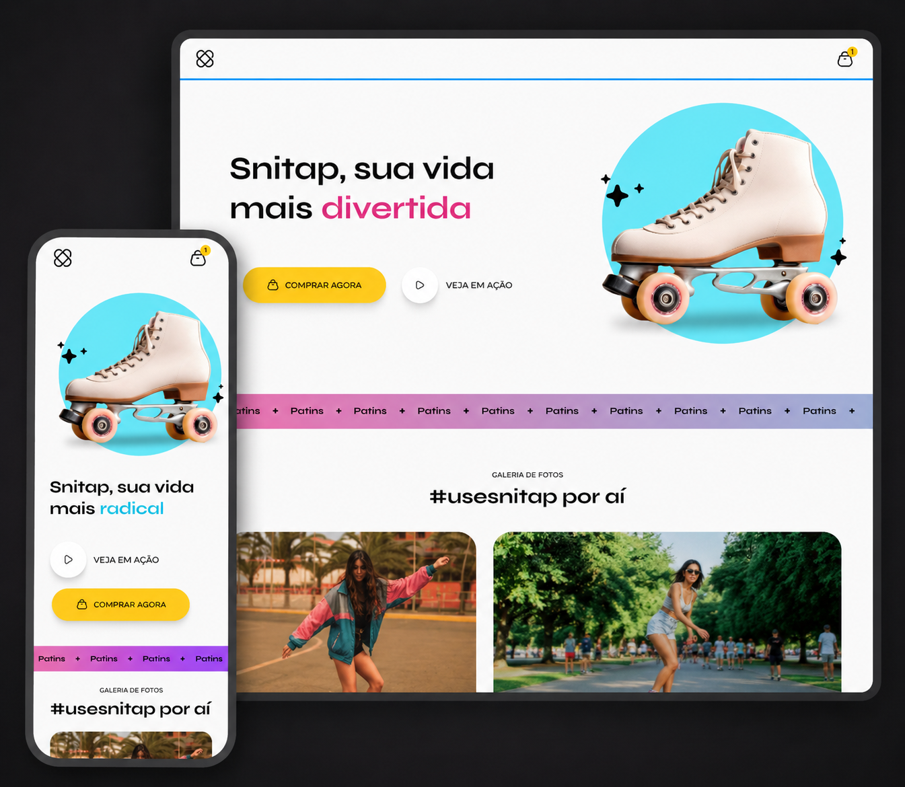

# 🛼 Snitap - Landing Page

Landing page responsiva desenvolvida durante meus estudos de **HTML e CSS**, com foco em animações, responsividade e construção de layouts modernos.

O projeto apresenta uma marca fictícia de patins, com uma interface colorida e interativa.

## 🚀 Demonstração

🔗 **Acesse o projeto:**  
https://crixlima.github.io/lp-patins/

## 📸 Preview

## ✨ Funcionalidades

- Layout responsivo para desktop e dispositivo móvel
- Animação dinâmica no título principal
- Animação de entrada dos elementos do Hero
- Efeitos de hover nos botões e imagens
- Banner animado
- Galeria de fotos responsiva

## 🛠️ Tecnologias utilizadas

- HTML5
- CSS3
- CSS Nesting
- Flexbox
- CSS Grid
- Media Queries
- CSS Animations
- Git
- GitHub Pages

## 📱 Responsividade

A interface foi adaptada para diferentes tamanhos de tela utilizando **Media Queries**.

No mobile, foram realizados ajustes específicos na disposição dos elementos, incluindo:

- reorganização do Hero;
- redimensionamento da imagem principal;
- adaptação da animação do título;
- reorganização dos botões;
- galeria em coluna única;
- footer adaptado para telas menores.

## 🎯 Objetivo do projeto

O objetivo deste projeto foi praticar conceitos mais avançados de CSS, principalmente:

- criação de animações com `@keyframes`;
- uso de `transform` e `transition`;
- layouts com Flexbox e Grid;
- CSS Nesting;
- responsividade;
- adaptação de layouts do Figma para código;
- organização e reutilização de estilos.

## 🎨 Layout

O layout original do projeto foi desenvolvido pela **Rocketseat** como parte do conteúdo de estudos da formação Full-Stack.

A implementação em HTML e CSS, assim como os ajustes de responsividade, foi realizada por mim com finalidade educacional.

Projeto desenvolvido para estudo e prática de desenvolvimento Front-end.
